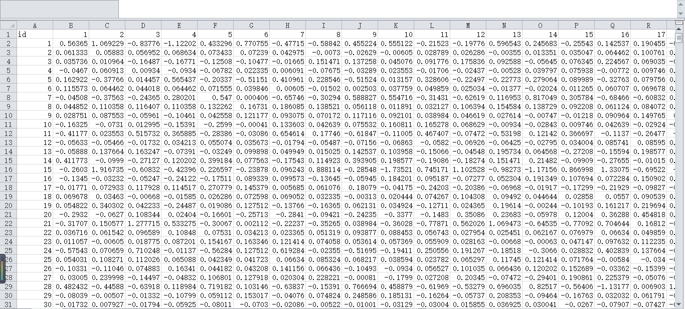
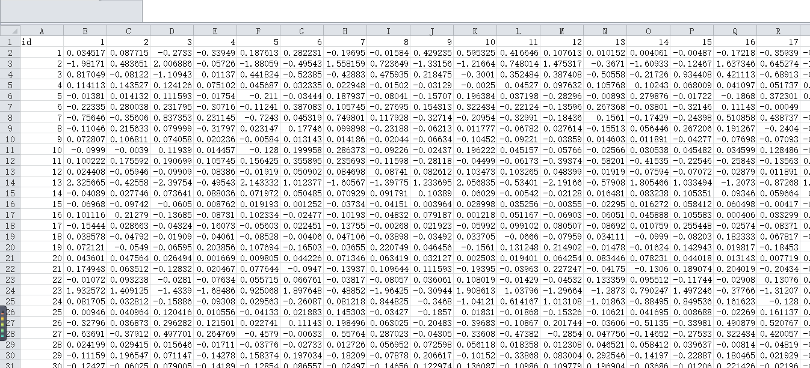
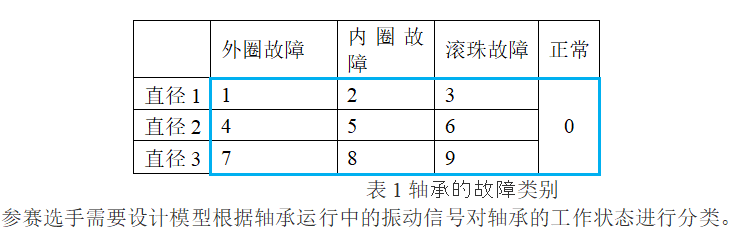

# DC Bearing Dataset

1. Competition Background: Bearings are one of the key components widely used in mechanical equipment. Due to overload, fatigue, wear, and corrosion, bearings can easily fail during machine operation. In fact, over 50% of rotating machine failures are related to bearing faults. In fact, rolling bearing faults can cause severe shaking of the equipment, stop production, halt production, or even result in personnel casualties. Generally speaking, early bearing weak faults are complex and difficult to detect. Therefore, monitoring and analyzing bearing status is very important, as it can identify early weak faults to prevent losses caused by faults.

In recent years, fault detection and diagnosis of bearings have been a hot topic. Among all types of bearing fault diagnosis methods, vibration signal analysis is one of the most important and useful tools. In this competition, we provide a real bearing vibration signal dataset, where participants need to use machine learning technology to judge the working state of the bearing.
2. Competition Task: There are three types of faults in the bearing: outer ring fault, inner ring fault, ball fault, and normal working status. As shown in Table 1, based on the three diameters (diameter 1, diameter 2, diameter 3), there are 10 categories of working status for the bearing:
3. Data Explanation: The two files available for download are:
1. train.csv, the training set data, which includes continuous sampling of vibration signal values from 1 to 6000, with each row representing a sample and a total of 792 data points. The first column is the id field, which represents the sample number, and the last column is the label field, which represents the working status of the bearing, represented by numbers 0 to 9.
2. test_data.csv, the test set data, with a total of 528 data points. Apart from the lack of the label field, other fields are the same as those in the training set. In summary, each row of data after removing the id and label fields represents the vibration signal data of a certain period of time for the bearing, and participants need to use these vibration signals to determine the working status of the bearing's label. Note that the same column's data may not be samples from the same time point, so do not treat each column as a feature.

## Images

Here is a pay link on Stripe ( https://buy.stripe.com/3cs8yP7sY87d0vu9AB ). Please contact me lonlonago@foxmail.com after funding $89, and I will send you a complete data files , thank you!

